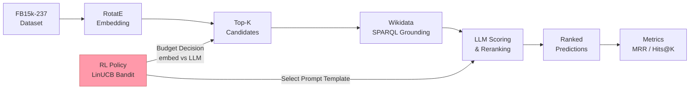

# LLM-Reranked Knowledge Graph Link Prediction with RL-based Prompt Policy Optimization


## Abstract

This project implements an end-to-end pipeline for knowledge graph (KG) link prediction that combines embedding-based candidate generation with large language model (LLM) reranking, enhanced by reinforcement learning (RL) for prompt policy and budget optimization. Given a query triple `(head, relation, ?)` from FB15k-237, a RotatE embedding model generates top-K candidate tail entities, which are grounded via Wikidata SPARQL to obtain natural-language labels and descriptions. An LLM then scores each candidate triple using one of five configurable prompt templates. A contextual bandit agent (LinUCB) learns to select the best prompt template per query based on 8-dimensional query features, while a separate budget allocation agent decides which queries benefit most from LLM reranking under a fixed API-call budget. Evaluation follows the standard filtered ranking protocol, reporting MRR, Hits@1, Hits@3, and Hits@10.

## Architecture



## Key Features

- **KG embedding baseline** — PyKEEN RotatE trained on FB15k-237
- **LLM triple scoring** — 5 configurable Jinja2 prompt templates (minimal, with descriptions, strict rubric, concise chain-of-thought, binary judge)
- **Wikidata SPARQL grounding** — entity label and description lookup with local disk cache
- **RL contextual bandit** — LinUCB and ε-greedy agents for prompt template selection
- **RL budget allocation** — 2-arm bandit deciding embedding-only vs. LLM reranking per query
- **Filtered ranking evaluation** — MRR, Hits@1, Hits@3, Hits@10 under standard filtered protocol
- **Cost tracking** — per-call token and USD cost logging, breakdown by template
- **Reproducibility** — seed management, experiment manifests, structured JSON logging

## Project Structure

```
.
├── configs/                    # YAML experiment configuration
│   └── default.yaml
├── docs/                       # Extended documentation
│   ├── ARCHITECTURE.md
│   ├── COST_TRACKING.md
│   ├── EVALUATION.md
│   ├── PROMPTS.md
│   └── RL_AGENTS.md
├── notebooks/                  # Jupyter notebooks (see table below)
├── scripts/                    # CLI entry points
│   ├── bandit_demo.py
│   ├── budget_demo.py
│   ├── budget_sweep.py
│   ├── check_config.py
│   ├── compare_templates.py
│   ├── cost_report.py
│   ├── download_fb15k237.py
│   ├── eval_dummy.py
│   ├── eval_embedding.py
│   ├── list_models.py
│   ├── llm_smoke_test.py
│   ├── rerank_demo.py
│   ├── resolve_sample_mids.py
│   ├── run_experiment.py
│   ├── smoke_load_dataset.py
│   └── train_embedding.py
├── src/
│   ├── config.py               # Pydantic settings
│   ├── experiment.py           # End-to-end experiment runner
│   ├── data/
│   │   └── fb15k237.py         # FB15k-237 dataset loader
│   ├── eval/
│   │   ├── candidates.py       # Candidate generation
│   │   ├── evaluate.py         # Evaluation harness
│   │   └── metrics.py          # MRR, Hits@K
│   ├── models/
│   │   ├── embedding_baseline.py  # PyKEEN RotatE wrapper
│   │   ├── llm_client.py       # OpenAI-compatible API client
│   │   ├── reranker.py         # LLM reranker
│   │   └── scorer.py           # LLM triple scorer
│   ├── prompts/
│   │   ├── renderer.py         # Template loading & rendering
│   │   └── templates.yaml      # 5 prompt templates
│   ├── rl/
│   │   ├── bandit.py           # LinUCB + EpsilonGreedy agents
│   │   ├── budget_agent.py     # RL budget allocation agent
│   │   ├── budget_experiment.py # Budget experiment runner
│   │   ├── features.py         # 8-dim query feature extraction
│   │   └── prompt_selector.py  # RL-driven prompt selection
│   ├── utils/
│   │   ├── cost_tracker.py     # LLM cost tracking
│   │   ├── logging_config.py   # Structured logging
│   │   └── reproducibility.py  # Seed management & manifests
│   └── wikidata/
│       ├── cache.py            # SPARQL result cache
│       └── sparql.py           # Wikidata entity grounding
└── tests/                      # Full pytest test suite
```

## Installation

```bash
# 1. Clone the repository
git clone https://github.com/HardikDhuri/LLM-Reranked-Knowledge-Graph-Link-Prediction-with-RL-based-Prompt-Policy-Optimization.git
cd LLM-Reranked-Knowledge-Graph-Link-Prediction-with-RL-based-Prompt-Policy-Optimization

# 2. Create and activate a virtual environment
python -m venv .venv
source .venv/bin/activate  # Windows: .venv\Scripts\activate

# 3. Install the package with all dependencies
pip install -e ".[dev]"

# 4. Configure environment variables
cp .env.example .env
# Edit .env and fill in your API key and any other settings
```

## Quick Start

```bash
# Download the FB15k-237 dataset
python -m scripts.download_fb15k237

# Train the RotatE embedding model
python -m scripts.train_embedding --epochs 50

# Run a full end-to-end experiment (no real LLM needed for smoke test)
python -m scripts.run_experiment --template minimal --num-queries 10

# Run the RL budget allocation experiment
python -m scripts.budget_demo --budget 10 --num-queries 20

# Run the RL bandit prompt-selection demo
python -m scripts.bandit_demo --num-queries 20
```

## Notebooks

| Notebook | Description | Requires API Key |
|---|---|---|
| `01_dataset_exploration.ipynb` | FB15k-237 statistics and triple inspection | No |
| `02_embedding_baseline.ipynb` | Train and evaluate RotatE embeddings | No |
| `03_wikidata_grounding.ipynb` | Entity grounding via Wikidata SPARQL | No |
| `04_llm_scoring.ipynb` | LLM triple scoring with prompt templates | Yes |
| `05_reranking_pipeline.ipynb` | Full reranking pipeline walkthrough | Yes |
| `06_rl_bandit.ipynb` | RL contextual bandit prompt selection | Yes |
| `07_budget_experiment.ipynb` | RL budget allocation experiment | Yes |
| `08_results_analysis.ipynb` | Results comparison and visualisation | No |

## Configuration

All settings are loaded from `.env` (or environment variables). Copy `.env.example` and edit as needed.

| Variable | Default | Description |
|---|---|---|
| `AI_GATEWAY_API_KEY` | *(required)* | API key for the LLM provider |
| `AI_GATEWAY_BASE_URL` | `https://ai-gateway.uni-paderborn.de/v1` | OpenAI-compatible base URL |
| `AI_GATEWAY_MODEL` | *(required)* | Model name (e.g. `gpt-4o-mini`) |
| `WIKIDATA_SPARQL_URL` | `https://query.wikidata.org/sparql` | Wikidata SPARQL endpoint |
| `WIKIDATA_USER_AGENT` | `kg-llm-rl-link-prediction/1.0` | HTTP User-Agent for Wikidata |
| `DATA_DIR` | `data_fb15k237` | Directory for dataset files |
| `CACHE_DIR` | `cache` | Directory for SPARQL and model caches |
| `RESULTS_DIR` | `results` | Directory for experiment outputs |
| `RANDOM_SEED` | `42` | Global random seed |
| `SAMPLE_TEST_QUERIES` | `15` | Number of test queries per experiment run |
| `NUM_CANDIDATES` | `25` | Top-K candidates generated per query |
| `TOPK_SHOW` | `5` | Number of top results to display |
| `RL_REWARD_LAMBDA` | `0.1` | Cost penalty weight in the RL reward |

## Testing

```bash
pytest tests/ -v
```

## How It Works

**Stage 1 — Candidate Generation.** The pipeline begins with the FB15k-237 benchmark dataset loaded via `src/data/fb15k237.py`. For each test query `(head, relation, ?)`, a RotatE embedding model (trained with PyKEEN) scores all entities and returns the top-K most plausible tail candidates (`src/eval/candidates.py`). Entity MIDs are resolved to human-readable labels and descriptions by querying the Wikidata SPARQL endpoint (`src/wikidata/sparql.py`), with results cached locally.

**Stage 2 — LLM Reranking.** Each candidate triple is rendered into a natural-language prompt using one of five Jinja2 templates managed by `src/prompts/renderer.py`. The prompt is sent to an OpenAI-compatible LLM via `src/models/llm_client.py`, which returns a plausibility score. The RL prompt-selection agent (`src/rl/prompt_selector.py`) uses a LinUCB contextual bandit to learn which template yields the best reward (reciprocal rank) for each query type, using 8 features extracted by `src/rl/features.py`. A separate budget allocation agent (`src/rl/budget_agent.py`) decides, for each query, whether to invoke the LLM or fall back to embedding-only ranking, optimising global MRR under a fixed API-call budget.

**Stage 3 — Evaluation.** Reranked candidates are evaluated under the standard *filtered* ranking protocol: all known true triples from train/valid/test are filtered out before computing ranks. Metrics computed by `src/eval/metrics.py` include Mean Reciprocal Rank (MRR) and Hits@1/3/10. LLM API costs are tracked per call and per template by `src/utils/cost_tracker.py`, and full experiment manifests (hyperparameters, seeds, git hash) are saved for reproducibility.

## References

- Sun, Z., Deng, Z., Nie, J., & Tang, J. (2019). **RotatE: Knowledge Graph Embedding by Relational Rotation in Complex Space.** *ICLR 2019.* [arXiv:1902.10197](https://arxiv.org/abs/1902.10197)
- Li, L., Chu, W., Langford, J., & Schapire, R. E. (2010). **A Contextual-Bandit Approach to Personalized News Article Recommendation.** *WWW 2010.* [arXiv:1003.0146](https://arxiv.org/abs/1003.0146)
- Toutanova, K., & Chen, D. (2015). **Observed versus Latent Features for Knowledge Base and Text Inference.** *3rd Workshop on CVSC (FB15k-237 dataset).*
- Ali, M., et al. (2021). **PyKEEN 1.0: A Python Library for Training and Evaluating Knowledge Graph Embeddings.** *JMLR 22(82), 1–6.*

## License

This project is licensed under the MIT License — see the [LICENSE](LICENSE) file for details.
