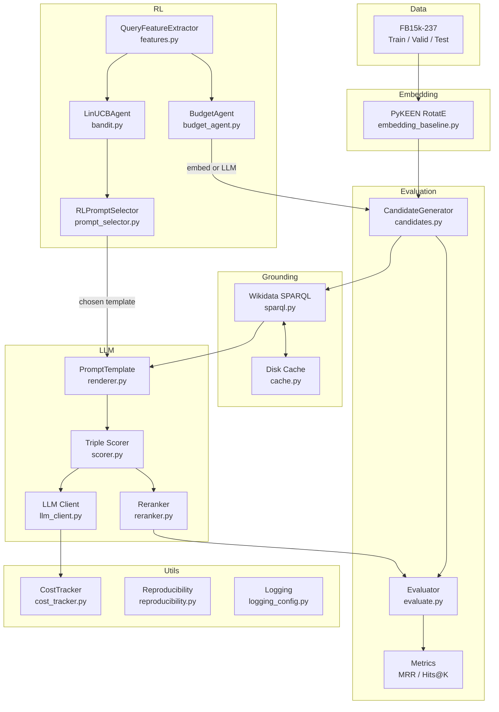
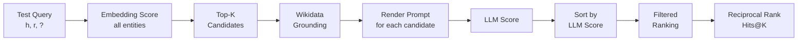
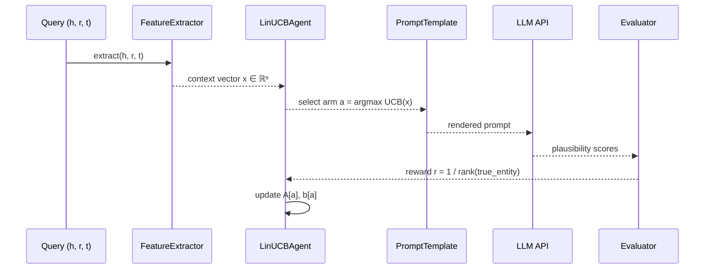
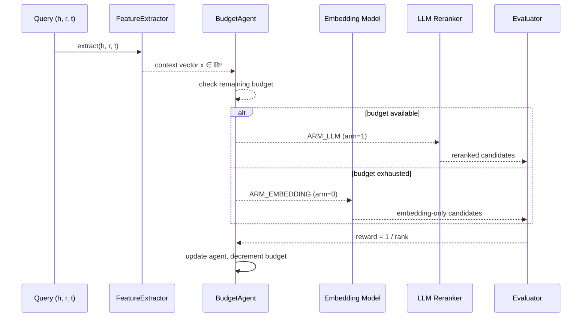
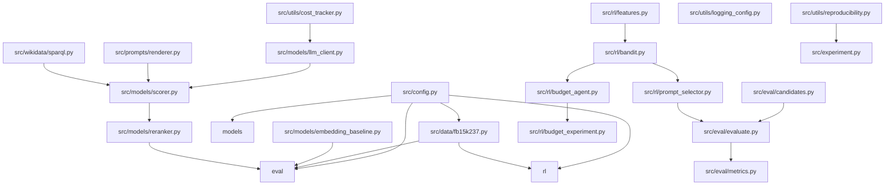

# System Architecture

This document describes the architecture of the LLM-Reranked KG Link Prediction pipeline with RL-based prompt and budget optimisation.

## Overall System Architecture



## Evaluation Pipeline



**Filtered ranking** removes all known true triples (from train, valid, and test) from the candidate list before computing the rank of the query answer. This avoids penalising the model for correctly ranking other true triples above the query answer.

## RL Prompt Selection Loop



The LinUCB agent maintains per-arm ridge regression parameters `(A, b)` and selects the arm (prompt template) with the highest upper confidence bound:

```
UCB_a(x) = θ_a^T x + α √(x^T A_a^{-1} x)
```

## RL Budget Allocation Loop



## Module Dependency Graph



## Data Flow Description

| Stage | Module | Input | Output |
|---|---|---|---|
| Dataset loading | `src/data/fb15k237.py` | Raw TSV files | Train/valid/test triple lists |
| Embedding training | `src/models/embedding_baseline.py` | Training triples | RotatE model checkpoint |
| Candidate generation | `src/eval/candidates.py` | Query + embedding model | Ranked entity list (top-K) |
| Entity grounding | `src/wikidata/sparql.py` | Entity MID list | Label + description dict |
| Prompt rendering | `src/prompts/renderer.py` | Template ID + entity data | Chat message list |
| LLM scoring | `src/models/scorer.py` | Message list | `(score, reason)` per triple |
| Reranking | `src/models/reranker.py` | Candidates + scores | Sorted candidates |
| Metric computation | `src/eval/metrics.py` | `RankingResult` list | MRR, Hits@1/3/10 |
| RL feature extraction | `src/rl/features.py` | Query triple | 8-dim feature vector |
| Prompt selection | `src/rl/prompt_selector.py` | Feature vector | Template ID |
| Budget decision | `src/rl/budget_agent.py` | Feature vector + budget | ARM_EMBEDDING or ARM_LLM |
| Cost tracking | `src/utils/cost_tracker.py` | API usage dict | Per-call cost records |
